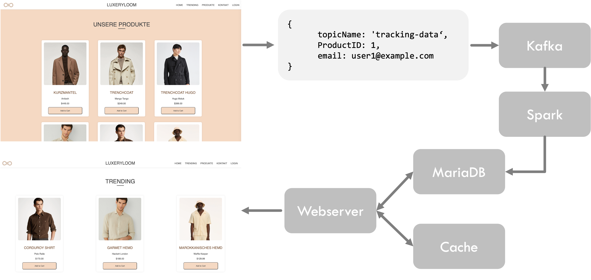

# Luxury Loom - Trendanalyse für Onlineshops

Timon Kuhl - 7594995  
Marwin Müller - 5555257  
Fabio Schumacher - 3579192  

## Voraussetzungen

Ein laufender Strimzi.io Kafka-Operator und ein laufender Hadoop-Cluster mit YARN (für Checkpointing) 

## Anwendung

Um mit [Skaffold](https://skaffold.dev/) zu entwickeln, verwenden Sie `skaffold dev`. 
Rufen Sie die Applikation über `localhost` auf, nachdem `minikube tunnel` ausgeführt haben. 

## Einleitung
Im Rahmen dieses Projekts wurde eine Big Data Architektur entwickelt, um Trendanalyse-Funktionen für einen Onlineshop bereitzustellen. Ziel dieser Funktionen ist es, die attraktivsten Produkte für Nutzer anzuzeigen und dadurch die Verkäufe zu steigern. Die Hauptfunktionen umfassen die Analyse von Modetrends und das Anzeigen zuletzt angesehener Produkte.

## Funktionen

### 1. Analyse der Modetrends
Um dem Nutzer beim Aufrufen der Webseite die attraktivsten Produkte anzeigen zu können, wird getrackt, wenn ein Benutzer ein Produkt zum Warenkorb hinzufügt. Die übermittelten Daten sind die folgenden:

```json
{
    "ProductID": 1,
    "email": "user1@example.com",
    "timestamp": 1604325221 
}
```

#### Funktionsweise

**Datenerfassung**: Bei jedem Hinzufügen eines Produkts zum Warenkorb werden die Produkt-ID, die E-Mail-Adresse des Nutzers sowie ein Zeitstempel erfasst.
**Datenaggregation**: Die gesammelten Daten werden in aggregierter Form ausgewertet, um die Produkte zu identifizieren, die am häufigsten zum Warenkorb hinzugefügt werden. 
**Anzeige der Trends**: Die aggregierten Daten werden zur Anzeige von Trends verwendet. Die beliebtesten Produkte werden als „Trending“ auf der Webseite angezeigt.

#### Nutzen

Die Anzeige der am häufigsten zum Warenkorb hinzugefügten Produkte erhöht die Wahrscheinlichkeit, dass Nutzer diese Produkte kaufen, was zu einer Steigerung der Gesamtverkäufe führt.

### 2. Zuletzt angesehene Produkte
Ist ein Nutzer im Onlineshop angemeldet, so wird ebenfalls eine E-Mail mitgeschickt. Auf diese Weise ist es möglich, dem Nutzer nicht nur die Produkte anzuzeigen, die aktuell im Trend sind, sondern auch diejenigen, die der angemeldete Nutzer zuletzt zum Warenkorb hinzugefügt hat.

#### Funktionsweise

**Personalisierte Datenerfassung**: Die Verwendung der E-Mail-Adresse des angemeldeten Nutzers ermöglicht die Nachverfolgung seiner Aktionen. 
**Personalisierte Anzeige**: Produkte, die der Nutzer bereits zum Warenkorb hinzugefügt, aber noch nicht gekauft hat, werden dem Nutzer erneut vorgeschlagen.

#### Nutzen

Die erneute Präsentation von Produkten, für die sich ein Nutzer bereits interessiert hat, erhöht die Wahrscheinlichkeit eines Kaufs. Diese Funktionalität wird ebenfalls von großen Webshops wie Amazon verwendet.

## Architektur


### Webserver
Der Webserver hostet die Frontend-Anwendung, mit der die Benutzer interagieren und basiert auf Node.js. Er fungiert als Schnittstelle zwischen den Benutzern und der Backend-Infrastruktur. 

### Frontend 
Das Frontend stellt einen Webshop dar. Dieser Webshop hat verschiedene Sections: Trending, in welcher die am häufigsten zum Warenkorb hinzugefügten Produkte angezeigt werden; Produkte, in welcher alle Produkte des Webshops angezeigt werden; Zuletzt angesehen, welche nur für angemeldete Nutzer sichtbar ist und die Produkte zeigt, welche zuletzt zum Warenkorb hinzugefügt wurden.

### Kafka & Spark
Die erhobenen Daten werden an Kafka gesendet, wobei diese verarbeitet und an Spark weitergeleitet werden. Spark verarbeitet diese Daten in Echtzeit, hierbei werden die Daten zunächst in eine Datenbank Tabelle geschrieben, welche die Informationen speichert. Auf Basis dieser Tabelle wird eine zweite Tabelle erstellt und verwaltet, welche die aggregierten Daten (ProduktIDs mit der Information wie oft dieses Produkt zum Warenkorb hinzugefügt wurde). Diese verarbeiten Daten werden dann verwendet um die Informationen für den Nutzer im Frontend anzuzeigen.

### MariaDB & Memcache
In der MariaDB werden alle Daten gespeichert, zusätzlich zu den Tabellen welche durch Spark verwaltet werden, gibt es eine Tabelle welche alle Produkte mit den jeweiligen Produktinformationen beinhaltet, sowie eine Tabelle welche die Nuzter beinhaltet. Beispielhafte Nutzerdaten sind:
```json
{
    "Email": "user1@example.com",
    "Password": "password1"
}
```
Die Produkte werden bei dem ersten Webseitenaufruf aus der Datenbank geladen und dabei im Memcache gespeichert, sodass diese dann bei dem Neuladen der Webseite nicht mehr aus der Datenbank, sondern aus dem Cache geladen werden.

# Herausforderungen
Zunächst hatten wir einige Probleme die bereitgestellte Beispielarchitektur in Betrieb zu nehmen, dies hat insbesondere den Anfangsprozess verlangsamt da dadurch das Testen des Use-Cases zunächst nicht möglich war. Nachdem die Inbetriebnahme gelungen war, konnte der Code getestet werden, was insbesondere das Codeverständnis gefördert hat.

# Lernerfahrungen
Im vorliegenden Projekt wurde die Nutzung und Kombination der verschiedenen, in der Vorlesung behandelten, Technologien für ein Big Data Umfeld erlernt. Hierfür wurde die bereitgestellte Architektur auf den Use-Case, die Trendanalyse in einem Online-Webshop, zugeschnitten und angepasst, sodass diese alle Anforderungen erfüllt und das Tracking von Produkten, welche zum Warenkorb hinzugefügt werden, ermöglicht.
Durch diese praktische Umsetzung wurde das Verständnis für die verschiedenen Technologien vertieft und insbesondere das Zusammenspiel von Technologien wie Kafka, Spark und Datenbanken anhand eines Beispiels deutlich.
